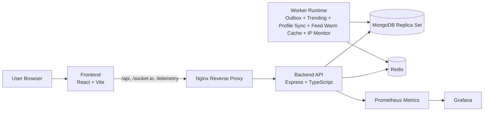

# Ascendance

> A full-stack social platform built to explore the problems that show up beyond CRUD.

[](https://www.typescriptlang.org/)
[](https://nodejs.org/)
[](https://react.dev/)
[](https://www.mongodb.com/)
[](https://redis.io/)
[](https://www.docker.com/)
[](https://prometheus.io/)
[](https://grafana.com/)

Ascendance is the product name in the UI. `image-app` is the repository name.

## About The Project

This is not a landing page portfolio project and it's not a wrapper around a database. Ascendance is a social product with real-time messaging, notifications, communities, favorites, profile management, admin tooling, multilingual UI, background processing, and production-style monitoring.

The repo is intentionally opinionated where it matters:

- CQRS on the backend for clearer read/write flows.
- Transaction-aware side effects through an outbox worker.
- Redis used for more than caching: sessions, fan-out support, notification state, and hot-path protection.
- Frontend instrumentation, lazy route loading, and i18n built into the app shell.
- Dockerized local and production-oriented deployment flows.

## What Changed Recently

The README was falling behind the codebase. The current project shape is:

- No dedicated API gateway anymore. The frontend container serves the built React app and proxies API, upload, WebSocket, and telemetry traffic directly to the backend.
- The monorepo now centers on two workspaces: `backend` and `frontend`.
- Workers can run in-process during app startup, or as a dedicated `backend-worker` container in Docker deployments.
- Backend internals have been moving toward specialized read/write repositories instead of broader generic repository abstractions.
- Request correlation IDs, telemetry ingestion, and stronger async workflow observability were added to improve debugging and operations.
- The frontend has expanded with communities, messaging, notifications, admin views, richer profile UX, and browser-language-aware internationalization.

## Architecture At A Glance



### Current Deployment Shape

| Layer      | What runs now                                | Why it matters                                                              |
| ---------- | -------------------------------------------- | --------------------------------------------------------------------------- |
| Frontend   | React app served by Nginx                    | Static hosting plus reverse proxying without a separate gateway service     |
| API        | Express backend                              | HTTP API, auth, uploads, read/write flows, Socket.IO, telemetry ingestion   |
| Workers    | Same backend codebase, separate runtime mode | Isolates async processing and lets the API stay focused on request handling |
| Data       | MongoDB replica set + Redis                  | Transactions, caching, session state, queue-like coordination               |
| Monitoring | Prometheus + Grafana                         | Visibility into HTTP, worker, and runtime health                            |

## Product Surface

Ascendance currently includes:

- Personalized home feed and discovery flows.
- Communities and community membership views.
- Post creation, favorites, comments, and post detail pages.
- Real-time messaging and notifications.
- Rich profile editing, follow graphs, avatar and cover updates.
- Admin dashboard and per-user admin detail screens.
- English and Bulgarian UI localization.

## Engineering Highlights

### Backend

- TypeScript + Express with `tsyringe`-based dependency injection.
- CQRS-style application layer with commands, queries, handlers, and bus wiring.
- Transaction-aware Unit of Work patterns on MongoDB.
- Outbox processing with correlation IDs and resumable handler progress.
- Redis-backed session management, cache coordination, and real-time support.
- Health, metrics, telemetry, and request logging surfaces for debugging and operations.

### Frontend

- React 18 + Vite + TypeScript.
- Route-level lazy loading and error boundaries in the app shell.
- TanStack Query for server-state orchestration.
- Material UI plus TailwindCSS for UI composition.
- Socket.IO client integration for live features.
- i18next-based language detection and translation resources.

### Infra And Operations

- Docker Compose for local full-stack startup.
- Separate production-oriented Compose file.
- Prometheus and Grafana included in-repo.
- Nginx proxying API, uploads, telemetry, and WebSocket traffic directly to the backend.

## Trade-Offs, On Purpose

This codebase deliberately explores patterns that are more advanced than the smallest version of the product would need. That is part of the point.

- CQRS improves clarity in several hot paths, but it also raises the maintenance bar.
- The outbox protects consistency for async work, but it adds operational surface area.
- Redis-heavy optimizations only justify themselves when measured.
- Dedicated workers simplify scaling and isolation, but they make deployment shape more explicit.

The value here is not "more architecture." The value is demonstrating where that architecture helps, where it costs, and how to keep the tradeoffs visible.

## Tech Stack

| Area     | Stack                                                                                        |
| -------- | -------------------------------------------------------------------------------------------- |
| Frontend | React, Vite, TypeScript, TanStack Query, Material UI, TailwindCSS, Socket.IO client, i18next |
| Backend  | Node.js, Express, TypeScript, TSyringe, Mongoose, Redis, Socket.IO, Zod, Winston             |
| Testing  | Mocha, Chai, Sinon, Supertest, Cypress                                                       |
| Infra    | Docker, Docker Compose, Nginx, Prometheus, Grafana                                           |
| Storage  | MongoDB, Redis, Cloudinary in production, local uploads in development                       |

## Running The Project

### Prerequisites

- Node.js 20+ recommended.
- Docker and Docker Compose for containerized startup.
- MongoDB and Redis access if you are running locally without Docker.

### Quick Start With Docker

```bash
git clone https://github.com/danzin/image-app.git
cd image-app
docker compose up --build
```

After startup:

- App: `http://localhost`
- Prometheus: `http://localhost:9090`
- Grafana: `http://localhost:3001`

The backend health endpoint is available internally to the stack at `/health` and is exposed directly during local non-Docker development.

### Local Development

Create a root `.env` with the values your backend needs.

```env
MONGODB_URI=mongodb://...
REDIS_URL=redis://localhost:6379
JWT_SECRET=replace-me
PORT=8000
FRONTEND_URL=http://localhost:5173
MONGO_INITDB_ROOT_USERNAME=replace-me
MONGO_INITDB_ROOT_PASSWORD=replace-me

GF_SECURITY_ADMIN_PASSWORD=replace-me
GF_SECURITY_ADMIN_USER=replace-me
REDIS_PASSWORD=replace-me
ADMIN_EMAILS=replace-me
VITE_API_URL=http://localhost:8000
VITE_SOCKET_URL=http://localhost:8000
DNS_SERVERS=1.1.1.1,8.8.8.8

```

Then install dependencies and start the workspace:

```bash
npm install
npm run dev
```

What `npm run dev` does now:

- Picks the first available backend port from a small candidate list.
- Writes that port to root `.env.local` and `frontend/.env.local`.
- Starts the backend API.
- Starts the trending, profile sync, and feed warm-cache workers.
- Starts the Vite frontend.

That means local dev no longer depends on a dedicated gateway process. The frontend proxies to whichever backend port was selected.

### Useful Scripts

```bash
# build everything
npm run build

# backend tests
npm run test-backend

# backend integration suite
npm run test-integration

# frontend production build
npm run build:frontend
```

## Security And Reliability Notes

- Hybrid JWT + Redis session model with refresh-token rotation.
- Rate limiting, secure cookies, and hardened proxy headers.
- Input sanitization and validation layers on the backend.
- Health endpoints and metrics endpoints for runtime checks.
- Correlation ID propagation through requests, logs, and async outbox work.

## Repository Structure

```text
.
├── backend/      # API, CQRS application layer, workers, data access, tests
├── frontend/     # React client, screens, shared UI, i18n, telemetry
├── monitoring/   # Prometheus configuration
├── scripts/      # local-dev helpers such as dynamic port selection
├── docker-compose.yml
└── docker-compose-prod.yml
```

## Why A Recruiter Or Engineer Might Care

Ascendance shows the kind of work that usually gets hidden behind the phrase "full-stack app":

- product thinking on the frontend,
- operational thinking in deployment and monitoring,
- systems thinking in caching, async processing, and runtime isolation,
- and architecture decisions that are opinionated enough to be discussable.
